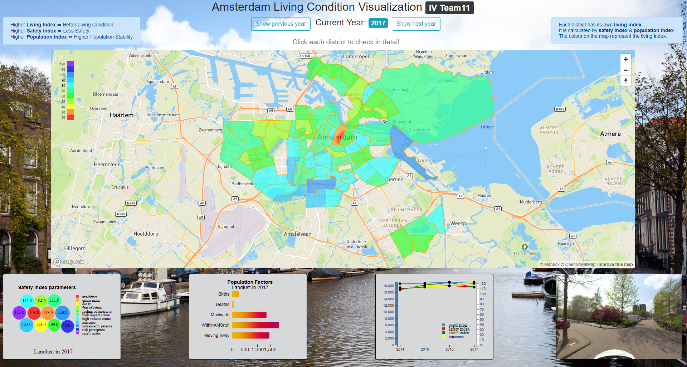

# Information Visualization - Team 11

# Deloy
https://ljm0.github.io/Visualization-Amsterdam/

# Abstract
- The visualization project on D3.js aims to help the users to find an ideal district to live in the Amsterdam. The final visualization presents an outlook on the living condition of each district based on living condition score on the map. The living condition score is the combination of Population Stability Score and Safety Score.
- We have used four sub graphs to give more detailed information based on multiple view design, which includes Bubble chart for safety, Bar chart for population, Line chart for correlation and Panoramic Graph to get an panoramic overview of the place.

# Get start
- python -m http.server 8888
- open your browser: http://localhost:8888/

# How do we compute the Score?
### Population Stability Score
- higher score means better population stability
- PopulationStabilityScore = {[Normalized[min:0,max:1]:(people working/population)]*100} + {[Normalized[min:0,max:1]:(people moving to/people moving away)]*100}

### Safety Score
- higher score means less secure
- Safety Score = Safety Index

### Living Condition Score:
- higher score means better living condition
- LivingConditionScore = PopulationStabilityScore - 0.5 * SafetyScore +100
- Maxium LivingConditionScore is 120
- Missing data is set to 0
